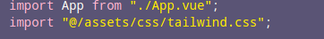

# :ledger: Platzi Exchange

Ejemplo del uso de vue-router y vue-resource.

### 🛠️ Tecnologías

- [**Node**](https://nodejs.org/en/): Node.js es un entorno en tiempo de ejecución multiplataforma, de código abierto, para la capa del servidor basado en el lenguaje de programación JavaScript, asíncrono, con E/S de datos en una arquitectura orientada a eventos y basado en el motor V8 de Google.
- [**Vue**](https://vuejs.org/): Vue es un framework progresivo para construir interfaces de usuario.
- [**Pug.js**](https://pugjs.org/language/attributes.html): Es un motor de plantilla de Node.js con el que se escribe código HTML de una sintaxis mucho más sencilla, clara y directa, tanto a la hora de escribir como de leer y modificar.
- [**tailwindcss**](https://tailwindcss.com/docs/installation/): framework de css que tiene utilidades de CSS, en vez de preocuparte por decidir que componente usar,TailwindCSS te da clases que hacen algo específico en CSS como poner texto en negritas, redondear bordes, poner sombras y cosas atómicas y pequeñas.

### **Pasos para Ejecutar**

- Clonar el proyecto del repositorio de git

```shell
    git clone https://github.com/anlramirezs11/
```

- Instalar dependencias

```
npm install
```

- Ejecutar en desarrollo

```
npm run serve
```

### Para lanzar a producción

```
npm run build
```

### Para limpiar y corregir archivos

```
npm run lint
```

### ¿Como se integró?

1- Para integrar pug al proyecto se corrieron las siguiente lineas de comando en la raíz del proyecto:

```
npm install pug
```

```
npm install pug-plain-loader
```

2. Para intalar TailwindCSS en vue, el profesor de platzi de Vue @ianaya89 creó el siguiente plugin para configurar y poner a funcionar TailwindCSS

```
vue add @ianaya89/tailwind
```

Despues de ejecutar el comando ir a main.js e importar el framework.


